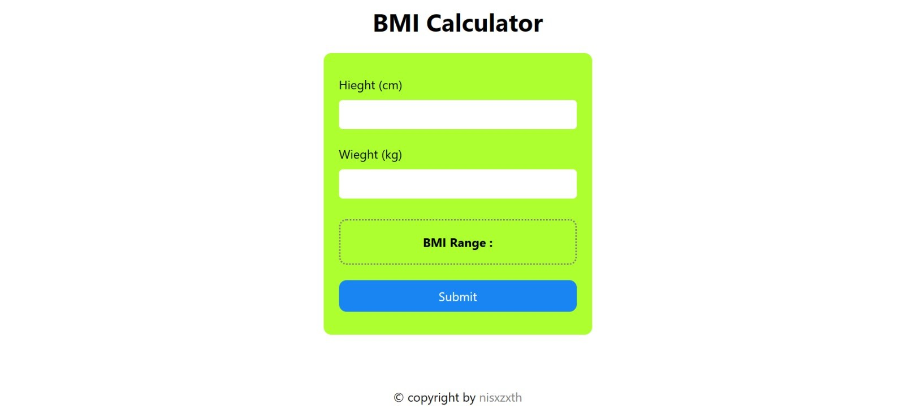

<h1>BMI Calculator</h1>
<h3>This is a simple BMI (Body Mass Index) calculator project built with HTML, CSS, and JavaScript.</h3>

The BMI Calculator is a web application that allows users to calculate their BMI by entering their weight and height. The BMI is a measure of body fat based on an individual's weight and height. This project provides a convenient way for users to calculate their BMI and get an idea of their overall health status. 

The project is implemented using HTML, CSS, and JavaScript. It has a user-friendly interface that makes it easy for users to input their weight and height, and instantly see the calculated BMI along with an interpretation of the result. 

<b>Features</b>: 
Calculate BMI based on weight and height inputs 
Display the calculated BMI 
Provide an interpretation of the BMI result (e.g., underweight, normal weight, overweight, obese) 
Clear input fields and reset the calculator 

<h3> here is the screenshot of BMI calci</h3>
